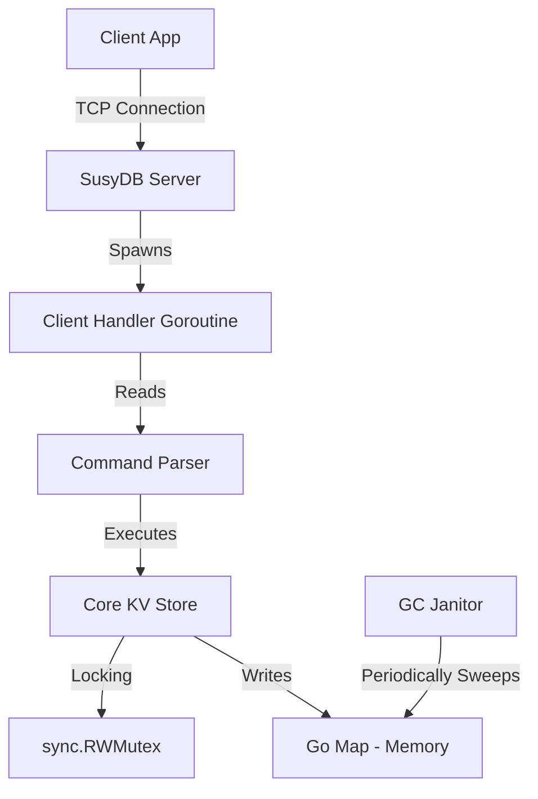

# SusyDB Architecture

This document describes the internal design and implementation details of SusyDB.

## High Level Overview

SusyDB is a single-process, multi-threaded key-value store. It uses a standard TCP socket to listen for client connections and processes them concurrently using lightweight Goroutines.

## Core Components

### 1. The Store (`pkg/core`)
The heart of SusyDB is the `KVStore` struct. It wraps a native Go map with a `sync.RWMutex` to ensure thread safety.

**Concurrency Model:**
- **Reads (`GET`, `HGET`)**: Use `RLock()`. Multiple readers can access the data simultaneously.
- **Writes (`SET`, `DEL`)**: Use `Lock()`. Writers get exclusive access, blocking other readers and writers.
- **Granularity**: The lock covers the entire dataset (Coarse-grained). This is simple and sufficient for 100k+ OPS on moderate hardware but limits scalability on 64+ core machines.

### 2. Expiry System (TTL)
SusyDB implements a hybrid expiry strategy to balance memory usage and performance.

- **Lazy Expiry**: When a client requests a key (via `GET`), the store checks if it is expired. If yes, it is deleted immediately and "Not Found" is returned.
- **Active Expiry**: A background Goroutine run every 1 second. It iterates over the map and deletes expired keys. (Note: In v1.0, this iterates the full map. Future versions will use random sampling).

### 3. Networking (`internal/server`)
- **Protocol**: A text-based protocol similar to Redis.
- **Handling**: Every new connection spawns a `go handleClient()` Goroutine.
- **I/O**: Uses `bufio.Reader` for efficient buffered reading from the TCP socket.

## Data Structures

### String
Stored as `Entry.Value` (interface{}). 
Used for `SET`, `GET`.

### Hash
Stored as `map[string]string` inside the `Entry.Value`.
Used for `HSET`, `HGET`.

### Atomic Counters
Stored as Strings but parsed to `int64` on every `INCR` operation. This allows flexibility but incurs a parsing overhead.

## Limitations
- **No Persistence**: Restarting the process loses all data.
- **No Clustering**: Single node only.
- **Memory**: Limited by RAM. No disk swapping.
